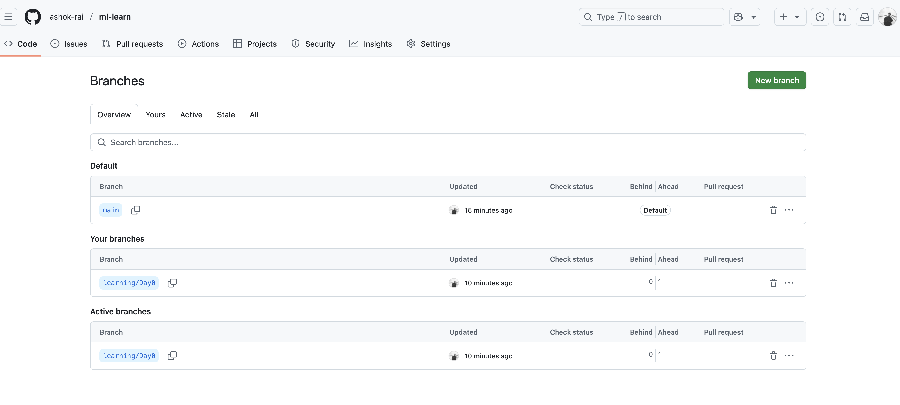

# 21-Day ML Learning Journey - Daily Diary

## Template for Daily Entries

### Day X: [Topic]
**Date**: 2025-05-28 & 2025-05-29

#### 🎯 Today's Goals
- [X] Install Python 3.11, VS Code/Jupyter, create GitHub account
- [X] Create repository "ml-learn"
- [x] Set up virtual environment and install requirements
- [X] Create learning-diary-day0.md for daily reflections

#### 📚 What I Learned
Setup all requirements and quick overview of the important doc,md,txt files

#### 💻 Model
What I built today:
```python
Setup new branches etc .. # Key code snippet or algorithm implemented
```

#### 📊 View


#### 🔍 Analysis
- What worked well: Setting up the doc and md files
- Challenges faced: Being used to of this new process of being accountability
- Improvements for next time: Have a proper separate time table and practice

#### 📝 Questions to Explore
- Question 1?: Nth for now
- Question 2?: NA

#### 🚀 Tomorrow's Plan
- Day 1's content exploration and self-oriented focus time for learning